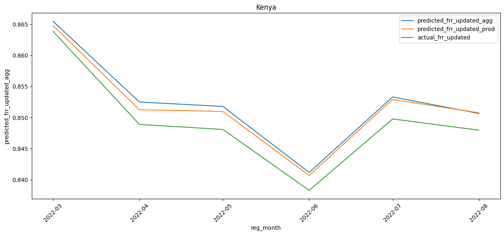
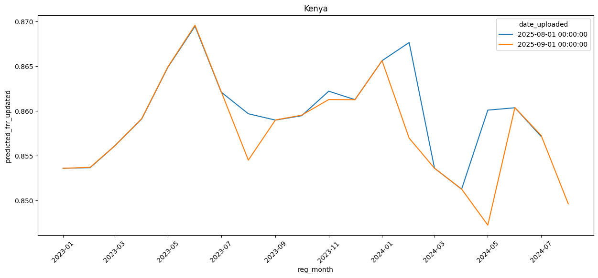
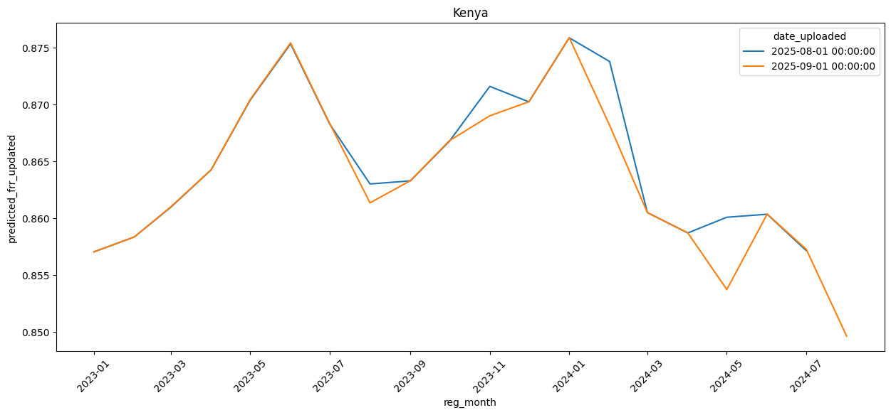
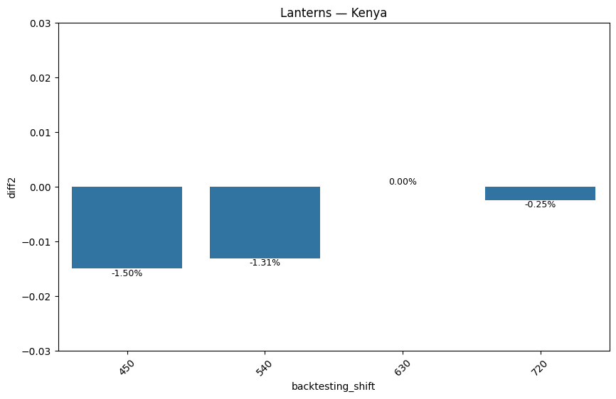
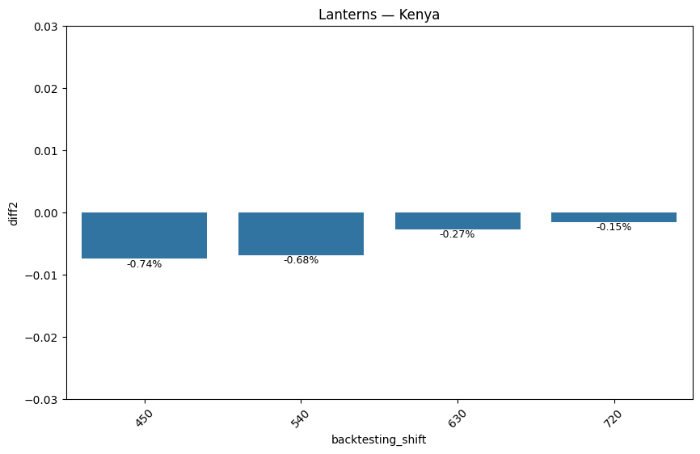

# DS12 - CBR360+ Over and Under Predictions
## Description of the Issue
We are observing **systematic over-prediction** by the CBR model during backtesting beyond the **360+ checkpoint**, specifically when features from later checkpoints (450, 640, 720) are introduced into the feature space.
- **Below 360:** Features corresponding to 450 and above are unavailable and represented as null, so model behavior remains stable.
- **Beyond 360:** As soon as the cohort reaches higher checkpoints, these additional features become available. The model appears to overweight these new signals, leading to consistent upward bias in predictions.


## Proposed Solution
We run a couple of experiments, but here, we will present the results from experiment that worked.

Current format:
The format of the inference data currently production is shown below. For September, the model sees the features up to 450 and for August, the model sees the features up to 360. The new 450 features pushes the prediction from 0.9016294658 to 0.8832106941
(a 1.84% difference). This difference is our main problem in this project.

| accounts_group                                        | frr_360  | frr_450  | frr_540 | cohort_age_backtesting | date_uploaded | predictions  |
| ----------------------------------------------------- | -------- | -------- | ------- | ---------------------- | ------------- | ------------ |
| 2024-05_Kenya_Lanterns_Kakamega_Sun King Boom EasyBuy | 0.564007 | 0.672026 |         | 450                    | 2025-09-01    | 0.8832106941 |
| 2024-05_Kenya_Lanterns_Kakamega_Sun King Boom EasyBuy | 0.564007 |          |         | 360                    | 2025-08-01    | 0.9016294658 |

The new idea is that, when we are making predictions for a cohort who's backtesting age is x>=450, why not perform predictions at each backtesting reached then aggregate predictions by averaging. For the case above, we expand the data as follows:

For September model, the model will now generate predictions at 360 and 450 for the given cohort of 2024-05 (instead of features up to 450 only. We then aggregate the results by averaging. In this case now, September model will predict (0.9016294658173110+0.8832106940722820)/2 = 0.8924200799

Compared to August prediction of 0.9016294658173110, the difference becomes 0.092%, down from the original 1.84%. 

| **accounts_group**                                        | **frr_360** | **frr_450** | **frr_540** | **cohort_age_backtesting** | Cohort Horizon | **date_uploaded** | **predictions**    |
| --------------------------------------------------------- | ----------- | ----------- | ----------- | -------------------------- | -------------- | ----------------- | ------------------ |
| **2024-05_Kenya_Lanterns_Kakamega_Sun King Boom EasyBuy** | 0.564007    |             |             | 450                        | 360            | 2025-09-01        | 0.9016294658173110 |
| **2024-05_Kenya_Lanterns_Kakamega_Sun King Boom EasyBuy** | 0.564007    | 0.672026    |             | 450                        | 450            | 2025-09-01        | 0.8832106940722820 |
| **2024-05_Kenya_Lanterns_Kakamega_Sun King Boom EasyBuy** | 0.564007    |             |             | 360                        | 360            | 2025-08-01        | 0.9016294658173110 |
|                                                           |             |             |             |                            |                |                   |                    |

Results for data format in prod
```json
{'rmse': 0.05060105371982129,
 'mae': 0.02473136830242729,
 'mape': 0.03953745155037692,
 'r2': 0.90473168432225,
 'qloss': 0.012365684151213646}
```
Results for expanded and aggregated data format (for cohorts with more than 1 unit - with a single unit aggregation can blow up):
```json
{
	'rmse': 0.043112065542757996,
	'mae': 0.026743637067918942,
	'mape': 0.0386926697845154,
	'r2': 0.8957044297528107,
	'qloss': 0.013371818533959471
 }
```

Here is how predicted_frr_agg, predicted_frr_prod and actual_frr compare in Kenya - the rest of the plots can be viewed/regenerate using `evaluation_agg.ipynb`.



Here is a plot of predictions for Aug and Sep cohort based on the the data format currently used in production.



Vs Aggregated prediction:

The difference is clear.


If we only focus on points of backtesting shift, here is what we get for Kenya Lanterns  - the rest of the plots can be viewed/regenerate using `inference_in_prod.ipynb` and `inference_new_agg.ipynb`.

Data format in production:



Aggregated predictions:
- The difference here is very clear.
- Aggregation reduces discrepancies significantly.



Conclusion: Based on the results, this becomes the final solution to the problem in this project.